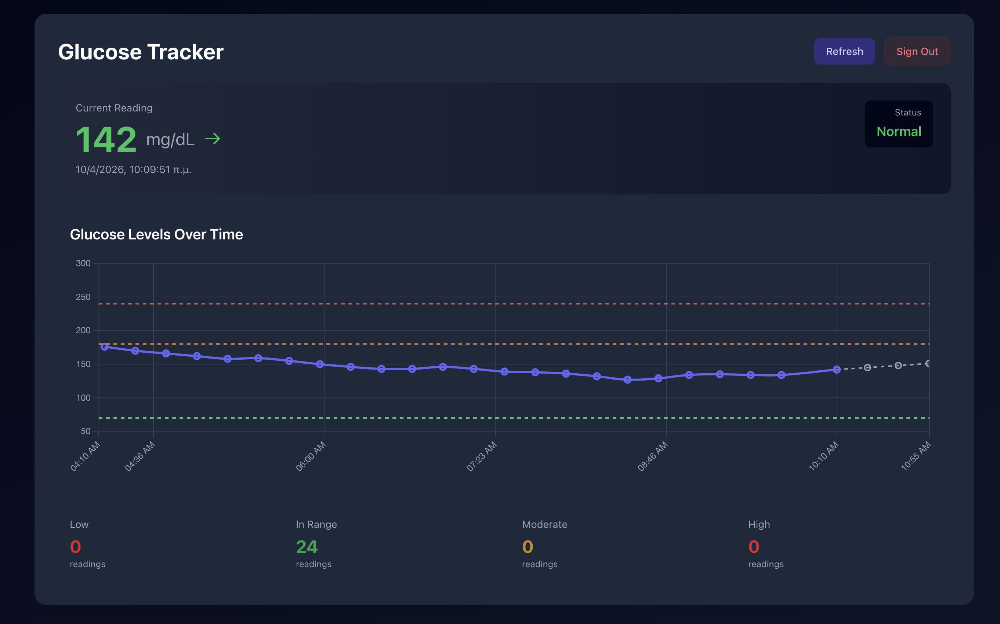

# 🩸 Glucose Monitor

> [!CAUTION]
> **MEDICAL DISCLAIMER**: This application is **NOT** an official Abbott or Libreview implementation. It is a community-driven tool intended **ONLY** for visualizing stored cloud data. **DO NOT** use this application or its predictions to make health-related decisions, medication adjustments, or any medical treatments. Always consult with a healthcare professional and use official hardware/software for medical monitoring.



A premium, modern web application for real-time glucose monitoring and predictive estimation. Built with **Next.js 15 (App Router)** and visually polished using **Tailwind CSS** and **Chart.js**, this dashboard provides users with actionable insights into their glucose trends with a sophisticated **Glassmorphism** aesthetic.

**🚀 Live App: [https://glucose-tracker.moisisv.com/](https://glucose-tracker.moisisv.com/)**

---

## ✨ Key Features

- **🔐 Secure Authentication**: Integrated login flow for Libreview accounts with session management via secure cookies.
- **🚀 Real-time Monitoring**: Continuous tracking of glucose levels with automatic background updates every minute.
- **📈 Smart Estimation**: Advanced forecasting of future glucose levels using **Least Squares Linear Regression** based on the last 45 minutes of data.
- **📊 Visual Analytics**: Interactive, responsive charts with dynamic reference lines for target (70 mg/dL), high (180 mg/dL), and very high (240 mg/dL) ranges.
- **🛡️ Visual Alerts**: Intuitive color-coded status indicators (Normal, Moderate, High, Low) and clear trend arrows (Up, Diagonal, Flat, Down).
- **🌓 Adaptive Design**: Sophisticated dark mode support that responds to system preferences.
- **🐳 Containerized**: Fully Dockerized for seamless deployment using Docker and Docker Compose.

---

## 🏗️ Technical Architecture

The application follows a modern full-stack architecture optimized for security and performance:

- **Frontend**: A React-based Single Page Application (SPA) using **Next.js 15 App Router**.
- **Authentication**: 
  - **Login Hook**: Intercepts `401 Unauthorized` responses to trigger a professional login modal.
  - **Session Security**: Stores JWT tokens and identifiers in **HTTP-only cookies** to prevent XSS attacks.
- **API Integration**: Proxied requests through Next.js API Routes to handle Libreview's custom headers and SHA256 hashing requirements.
- **Data Logic**: 
  - **Parsing**: Advanced timestamp normalization for consistent temporal mapping across different timezones.
  - **Regression**: In-browser linear regression to calculate trend slopes and forecast future values ($t+15, t+30, t+45$ mins).

---

## 📁 Project Structure

```text
glucose-monitor/
├── app/                  # Next.js App Router directory
│   ├── api/              # Backend API routes
│   │   ├── auth/         # Libreview login and session setup
│   │   └── glucose/      # Data proxy with SHA256 header hashing
│   ├── layout.js         # Root layout with Tailwind fonts
│   └── page.js           # Main Dashboard UI and Logic
├── public/               # Static assets (icons, images)
├── tailwind.config.js    # Design system configuration
├── Dockerfile            # Container definition
├── docker-compose.yml    # Development environment orchestration
└── layout.png            # Application screenshot
```

---

## 🚀 Getting Started

### Prerequisites

| Tool | Version |
| :--- | :--- |
| Node.js | v20+ |
| npm | v10+ |
| Docker | Latest (Recommended) |

### Development Setup

1. **Clone & Install**:
   ```bash
   git clone <repository-url>
   cd glucose-monitor
   npm install
   ```

2. **Run Dev Server**:
   ```bash
   npm run dev
   ```
   Open [http://localhost:3000](http://localhost:3000) to see the live dashboard.

3. **Docker Deployment**:
   ```bash
   docker-compose up --build
   ```
   Access the app at [http://localhost:53000](http://localhost:53000).

---

## 🛠️ API & Libreview Integration

The application communicates with the unofficial **LibreLinkUp** API. 

### Local Endpoints

| Method | Endpoint | Description |
| :--- | :--- | :--- |
| `POST` | `/api/auth` | Authenticates with Libreview and sets session cookies (`libre_token`, `libre_account_id`). |
| `GET` | `/api/glucose` | Fetches recent data, appearing as `401` if the session is expired. |

### Libreview API Specifications

The following upstream endpoints are utilized:

1. **Authentication**: `POST /llu/auth/login`
   - Returns a JWT Bearer token and user identifiers.
2. **Patient Discovery**: `GET /llu/connections`
   - Retrieves the `patientId` for the data stream.
3. **Data Retrieval**: `GET /llu/connections/{patientId}/graph`
   - Requires specific headers:
     - `Authorization: Bearer <token>`
     - `Account-Id: <SHA256_HASH_OF_USER_ID>`
     - `product: llu.android`, `version: 4.16.0`

> [!IMPORTANT]
> The **Account-Id** header is mandatory and must be a 64-character hex-encoded SHA256 hash of the plain user ID provided during login. This hashing is handled automatically by the application's backend routes.

---

## 🔐 Session & Local Development

### Session management
The application provides a dedicated way to terminate your session and clear all stored data:
- **Automatic Re-authentication**: If your session expires (e.g., after 30 days), the application will automatically detect the `401 Unauthorized` response and prompt you to log in again via the glassmorphism modal.
- **Manual Sign Out**: Click the **Sign Out** button in the dashboard header.
- **Direct Access**: Visit the `/unauthorized` route to immediately wipe all session cookies and redirect to the login screen.

### Local Development fallback
For developers who want to skip the login process during local testing, you can copy `.env.example` to `.env` and provide your own hashed Account ID and Connection ID.

```bash
# Example .env configuration
LIBREVIEW_ACCOUNT_ID_HASH=your_sha256_hash_here
LIBREVIEW_CONNECTION_ID=your_connection_uuid_here
```

---

## 📊 Estimation Logic

The application uses **Least Squares Linear Regression** to predict glucose trends. 

- **Input**: The most recent 45 minutes of valid glucose readings.
- **Calculation**: 
  - A slope ($m$) is derived from the $(timestamp, value)$ pairs.
  - Future values are calculated as: $EstimatedValue = LatestValue + (Slope \times MinutesAhead)$.
- **Visualization**: Forecasted values are displayed as a distinct dashed secondary dataset on the main chart, updated every minute.

---

## 🚀 CI/CD & Deployment

This project is configured for automated deployment to **Vercel** via **GitHub Actions**.

### Automated Workflow
The deployment triggers automatically on every push to the `main` branch. The workflow:
1.  Installs the Vercel CLI.
2.  Pulls the remote environment configuration.
3.  Builds the production-optimized Next.js application.
4.  Deploys the prebuilt artifacts to the Vercel production environment.

### Required Secrets
To enable this pipeline in your GitHub repository, add the following **Actions Secrets** (`Settings` > `Secrets and variables` > `Actions`):

| Secret Name | Description |
| :--- | :--- |
| `VERCEL_TOKEN` | Vercel Personal Access Token ([Generate here](https://vercel.com/account/tokens)) |
| `VERCEL_ORG_ID` | Your Vercel Account or Team ID |
| `VERCEL_PROJECT_ID` | The ID of this project in Vercel |

---

## 🛡️ Security & Privacy

- **No Data Persistence**: This application does not use a database. No personal data is stored anywhere except for the necessary authentication session cookies. It acts as a stateless proxy to the Libreview cloud.
- **Cookie Consent**: Upon first visit, the application prompts for consent to use cookies. These are strictly necessary for session management and authentication. If declined, the application will block authentication as it cannot maintain a secure session.
- **Secure Cookies**: Session data is stored in `httpOnly` and `secure` cookies, which are inaccessible to client-side scripts. The following cookies are utilized:
  - `libre_token`: The Libreview JWT authentication ticket.
  - `libre_account_id`: Your Libreview account identifier.
  - `libre_connection_id`: The specific patient identifier for the data stream.
- **Privacy First**: All personal identifiers have been removed from the source code. The app dynamically identifies your data stream upon login and does not track user behavior.

---

## 📄 License

Distributed under the [MIT](LICENSE) License.

